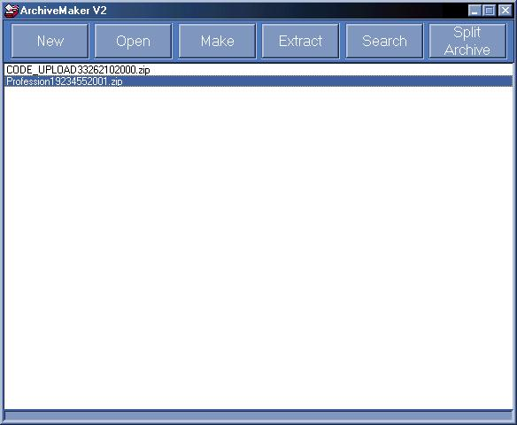

<div align="center">

## Making Archives From Files V2 IN PURE VB\!


</div>

### Description

It can make an archive from any files (without compression) and can extract them. It can open an archive and show the contents. Also it can split an archive and it can show the contents of a splitted archive. It has got an internal viewer.

Faster then CYBER-CRYPT!
 
### More Info
 


<span>             |<span>
---                |---
**Submitted On**   |2002-08-31 10:31:14
**By**             |[actorics\.de](https://github.com/Planet-Source-Code/PSCIndex/blob/master/ByAuthor/actorics-de.md)
**Level**          |Intermediate
**User Rating**    |5.0 (15 globes from 3 users)
**Compatibility**  |VB 6\.0
**Category**       |[Files/ File Controls/ Input/ Output](https://github.com/Planet-Source-Code/PSCIndex/blob/master/ByCategory/files-file-controls-input-output__1-3.md)
**World**          |[Visual Basic](https://github.com/Planet-Source-Code/PSCIndex/blob/master/ByWorld/visual-basic.md)
**Archive File**   |[Making\_Arc125230912002\.zip](https://github.com/Planet-Source-Code/actorics-de-making-archives-from-files-v2-in-pure-vb__1-38554/archive/master.zip)


### Source Code

```
It can make an archive from any files (without compression) and can extract them. It can open an archive and show the contents. Also it can split an archive and it can show the contents of a splitted archive. It has got an internal viewer.
Faster then CYBER-CRYPT!
Click on "Download Article" to download the source-code.
If you want to use the code in your app then just paste all functions and subs in the general-section in you code.
How to use the code will show you the code.
Have fun!
If you like this code, VOTE!
```

